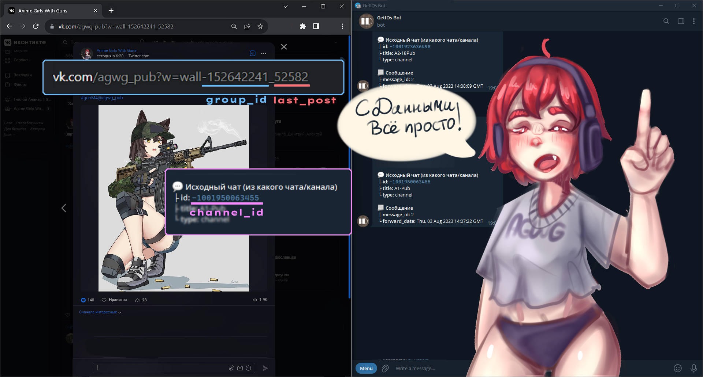

<h1>TEA<a href="vk.com">VK</a> - VK to Telegram post retranslate</h1>
</img>
<h2>Авто-пост публикаций из VK в ТГ</h2>
<h2>Из фишек</h2>
<p>

- Ретрансляция постов из ВК в Телеграм
- Возможность добавить бесконечно большое количество, как групп, так и каналов TG
- Сохранение особо крупных постов (1000 символов) в Telegraph
- TODO: Вытаскивать Видео? Музыку?

</p>

<h1>🔧 | Настройка</h1>

[**ВНИМАНИЕ С ВЕРСИИ 0.2.6 НЕ РАБОТАЕТ ЛОГИН ПО ПАРОЛЮ**](https://github.com/kaiyga/TeaVK/issues/3)

- Советую ознакомится с [инструкцией](./tokenlogin.md)

<h3>
Можете воспользоваться <a href="./config_clear.yml">Clear Config</a>, чтобы начать настройку бота.
</h3>

<h2> Объект group</h2>

<h3>Groups состоит из объектов group, именна которых прямо совпадают с Group-ID VK </h3>
<p>

Group содержат в себе:

- last_post - ID Последнего поста
- channels - список ID TG-Каналов для репостов. Это может быть и просто Ваш ID, чтобы принимать сообщения в ЛС

</p>
<p>
Подобная структура позволяет, увеличивать или уменьшать колличество отслеживаемых групп и при этом контролировать отправку постов в разные каналы
</p>




```yaml
groups:
  -101010101: #Сюда ID VK Стены.
    channels: # Это список каналов.
    #Чёрточки перед TG-Channel обязательны! yaml-list!
    - -1011011011011 #TG-Channel один
    - -2021021021021 #TG-Channel Два, если нужно, можно убрать/добавить
    last_post: 144888

#Ваши Логин и пароль
vk:
  login: SUPER_LOGIN!
  password: SUPER_PASSWORD!
  token: vk.AAAAAAAATOKEN!!!! # __Обязательно [0.2.6]__
# Токен используется первичнее login:password, если есть проблемы с токеном, лучше его убрать
# - Не для [0.2.6] Т.К только этот метод на данный момент рабочий 

tg_bot: 0101010101:yabototvetchauyblyabudu
#Здесь всё просходит автоматически, можете не менять
tgph:
  name: Name
  #Token получается автоматически 
  token: AUTO_CONFIGURE
```

<h1>Установка, запуск</h1>
<a href="https://github.com/kaiyga/TeaVK/wiki">Я написал, обо всём в вики^^</a>
